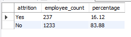
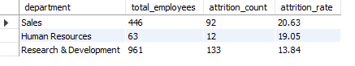
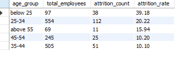
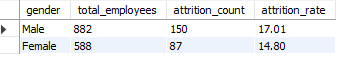
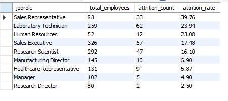
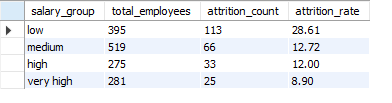
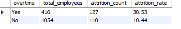
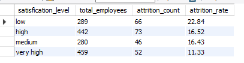
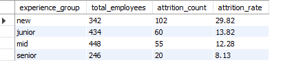
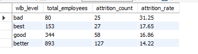

#  HR Employee Attrition Analysis


##  Project Overview

Employee attrition is one of the most critical challenges faced by HR departments worldwide. High attrition leads to increased recruitment costs, loss of institutional knowledge, and reduced team productivity.

This project performs an **end-to-end HR analytics study** on the IBM HR Employee Attrition Dataset to uncover the key drivers behind employee turnover and provide actionable business recommendations.

---

##  Objective

- Understand why employees leave the organization
- Analyze attrition patterns across age, salary, department, job role, overtime, and more
- Provide data-driven business recommendations to improve employee retention

---

##  Tools Used

| Tool | Purpose |
|------|---------|
| **Microsoft Excel** | Data Cleaning & Preprocessing |
| **MySQL Workbench** | SQL Queries & Business Analysis |
| **Power BI Desktop** | Interactive Dashboard |
| **GitHub** | Version Control & Portfolio |

---

##  Dataset

The dataset contains employee details such as Age, Department, Job Role, Salary, Overtime, Job Satisfaction, Work-Life Balance, and Attrition.

- **Source**: IBM HR Analytics Dataset (Kaggle)  
- **File**: `hr_employee_attrition.csv`  
- **Records**: 1470 employees  
- **Features**: 35 columns  
- **Target Variable**: Attrition (Yes/No)  

 [Download Dataset](hr_employee_attrition.csv)
---

##  Data Cleaning (Excel)

-  **Duplicate Check** — No duplicate records found
-  **Null/Blank Check** — No missing values found
-  **Data Type Correction** — Numeric columns formatted correctly
-  **Outlier Detection** — No outliers found in MonthlyIncome
-  **Irrelevant Columns Noted** — `StandardHours` (constant = 80) and `EmployeeCount` (constant = 1) flagged as non-analytical

---

#  SQL Analysis with Insights

---

##  1. Overall Attrition Rate

### SQL Query
```sql
SELECT attrition,
COUNT(*) AS employee_count,
ROUND(COUNT(*) * 100.0 / (SELECT COUNT(*) FROM hr_employee_attrition1), 2) AS percentage
FROM hr_employee_attrition1
GROUP BY attrition;
```

### Output


###  Insight
> The overall attrition rate is **16.12%** — significantly above the industry benchmark of 10%. This means **237 out of 1,470 employees** left the organization, resulting in approximately **90 unexpected departures** beyond acceptable levels.

---

##  2. Attrition by Department

### SQL Query
```sql
WITH dept_attrition AS (
    SELECT department,
    COUNT(*) AS total_employees,
    SUM(CASE WHEN attrition = 'Yes' THEN 1 ELSE 0 END) AS attrition_count
    FROM hr_employee_attrition1
    GROUP BY department
)
SELECT department, total_employees, attrition_count,
ROUND(attrition_count * 100.0 / total_employees, 2) AS attrition_rate
FROM dept_attrition
ORDER BY attrition_rate DESC;
```

### Output


###  Insight
> **Sales department** has the highest attrition rate at **20.63%**, followed by Human Resources at 19.05%. Research & Development, despite having the most employees, has the lowest rate at 13.84% — suggesting that high-pressure sales targets are a key driver of turnover.

---

##  3. Attrition by Age Group

### SQL Query
```sql
WITH age_group AS (
    SELECT 
    CASE 
        WHEN age < 25 THEN 'Below 25'
        WHEN age BETWEEN 25 AND 34 THEN '25-34'
        WHEN age BETWEEN 35 AND 44 THEN '35-44'
        WHEN age BETWEEN 45 AND 54 THEN '45-54'
        ELSE 'Above 55'
    END AS age_group,
    attrition
    FROM hr_employee_attrition1
)
SELECT age_group,
COUNT(*) AS total_employees,
SUM(CASE WHEN attrition = 'Yes' THEN 1 ELSE 0 END) AS attrition_count,
ROUND(SUM(CASE WHEN attrition = 'Yes' THEN 1 ELSE 0 END) * 100.0 / COUNT(*), 2) AS attrition_rate
FROM age_group
GROUP BY age_group
ORDER BY attrition_rate DESC;
```

### Output


###  Insight
> **Below 25 age group** has the highest attrition rate at **39.18%** — nearly 4 in 10 young employees are leaving. While the 25-34 group has higher absolute numbers (112 left), the rate-based analysis reveals that younger employees are proportionally most at risk, likely due to career exploration and better opportunities elsewhere.

---

##  4. Attrition by Gender

### SQL Query
```sql
WITH gender_attrition AS (
    SELECT gender,
    COUNT(*) AS total_employees,
    SUM(CASE WHEN attrition = 'Yes' THEN 1 ELSE 0 END) AS attrition_count
    FROM hr_employee_attrition1
    GROUP BY gender
)
SELECT gender, total_employees, attrition_count,
ROUND(attrition_count * 100.0 / total_employees, 2) AS attrition_rate
FROM gender_attrition
ORDER BY attrition_rate DESC;
```

### Output


###  Insight
> **Male employees** show a slightly higher attrition rate (**17.01%**) compared to females (**14.80%**). While the gap is not extreme, it suggests male employees may be more actively seeking external opportunities or facing different workplace pressures.

---

##  5. Attrition by Job Role

### SQL Query
```sql
WITH jobrole_attrition AS (
    SELECT jobrole,
    COUNT(*) AS total_employees,
    SUM(CASE WHEN attrition = 'Yes' THEN 1 ELSE 0 END) AS attrition_count
    FROM hr_employee_attrition1
    GROUP BY jobrole
)
SELECT jobrole, total_employees, attrition_count,
ROUND(attrition_count * 100.0 / total_employees, 2) AS attrition_rate
FROM jobrole_attrition
ORDER BY attrition_rate DESC;
```

### Output


###  Insight
> **Sales Representatives** have the highest attrition rate at **39.76%**, followed by Laboratory Technicians at 23.94%. Research Directors and Managers have the lowest rates, suggesting senior and specialized roles have better retention due to higher compensation and job stability.

---

##  6. Attrition by Salary Group

### SQL Query
```sql
WITH salary_group AS (
    SELECT 
    CASE 
        WHEN monthlyincome < 3000 THEN 'Low'
        WHEN monthlyincome BETWEEN 3000 AND 6000 THEN 'Medium'
        WHEN monthlyincome BETWEEN 6000 AND 10000 THEN 'High'
        ELSE 'Very High'
    END AS salary_group,
    attrition
    FROM hr_employee_attrition1
)
SELECT salary_group,
COUNT(*) AS total_employees,
SUM(CASE WHEN attrition = 'Yes' THEN 1 ELSE 0 END) AS attrition_count,
ROUND(SUM(CASE WHEN attrition = 'Yes' THEN 1 ELSE 0 END) * 100.0 / COUNT(*), 2) AS attrition_rate
FROM salary_group
GROUP BY salary_group
ORDER BY attrition_rate DESC;
```

### Output


###  Insight
> **Low salary employees** (below $3,000/month) have the highest attrition at **28.61%**. As salary increases, attrition drops significantly — Very High salary group shows only 8.90% attrition. This confirms that **compensation is a primary driver of employee turnover**.

---

##  7. Overtime Impact on Attrition

### SQL Query
```sql
WITH overtime_attrition AS (
    SELECT overtime,
    COUNT(*) AS total_employees,
    SUM(CASE WHEN attrition = 'Yes' THEN 1 ELSE 0 END) AS attrition_count
    FROM hr_employee_attrition1
    GROUP BY overtime
)
SELECT overtime, total_employees, attrition_count,
ROUND(attrition_count * 100.0 / total_employees, 2) AS attrition_rate
FROM overtime_attrition
ORDER BY attrition_rate DESC;
```

### Output


###  Insight
> Employees working overtime have an attrition rate of **30.53%** — nearly **3x higher** than those who don't (10.44%). This is one of the strongest predictors of attrition, highlighting severe burnout and work-life imbalance issues.

---

##  8. Job Satisfaction Impact on Attrition

### SQL Query
```sql
WITH satisfaction_rate AS (
    SELECT
    CASE
        WHEN jobsatisfaction = 1 THEN 'Low'
        WHEN jobsatisfaction = 2 THEN 'Medium'
        WHEN jobsatisfaction = 3 THEN 'High'
        ELSE 'Very High'
    END AS satisfication_level,
    attrition
    FROM hr_employee_attrition1
)
SELECT satisfication_level,
COUNT(*) AS total_employees,
SUM(CASE WHEN attrition = 'Yes' THEN 1 ELSE 0 END) AS attrition_count,
ROUND(SUM(CASE WHEN attrition = 'Yes' THEN 1 ELSE 0 END) * 100.0 / COUNT(*), 2) AS attrition_rate
FROM satisfaction_rate
GROUP BY satisfication_level
ORDER BY attrition_rate DESC;
```

### Output


###  Insight
> Employees with **low job satisfaction** have the highest attrition rate at **22.84%**. As satisfaction improves, attrition decreases. This suggests that investing in employee engagement, recognition, and workplace culture can significantly reduce turnover.

---

##  9. Attrition by Years at Company

### SQL Query
```sql
WITH experience_group AS (
    SELECT
    CASE
        WHEN yearsatcompany <= 2 THEN 'New (0-2 yrs)'
        WHEN yearsatcompany BETWEEN 3 AND 5 THEN 'Junior (3-5 yrs)'
        WHEN yearsatcompany BETWEEN 6 AND 10 THEN 'Mid (6-10 yrs)'
        ELSE 'Senior (10+ yrs)'
    END AS experience_group,
    attrition
    FROM hr_employee_attrition1
)
SELECT experience_group,
COUNT(*) AS total_employees,
SUM(CASE WHEN attrition = 'Yes' THEN 1 ELSE 0 END) AS attrition_count,
ROUND(SUM(CASE WHEN attrition = 'Yes' THEN 1 ELSE 0 END) * 100.0 / COUNT(*), 2) AS attrition_rate
FROM experience_group
GROUP BY experience_group
ORDER BY attrition_rate DESC;
```

### Output


###  Insight
> **New employees (0-2 years)** have the highest attrition at **29.82%**. Attrition consistently decreases as tenure increases — Senior employees (10+ years) show only 8.13% attrition. This highlights the critical importance of a strong onboarding program and early employee engagement strategy.

---

##  10. Work-Life Balance Impact on Attrition

### SQL Query
```sql
WITH wlb_attrition AS (
    SELECT
    CASE
        WHEN worklifebalance = 1 THEN 'Bad'
        WHEN worklifebalance = 2 THEN 'Good'
        WHEN worklifebalance = 3 THEN 'Better'
        ELSE 'Best'
    END AS wlb_level,
    attrition
    FROM hr_employee_attrition1
)
SELECT wlb_level,
COUNT(*) AS total_employees,
SUM(CASE WHEN attrition = 'Yes' THEN 1 ELSE 0 END) AS attrition_count,
ROUND(SUM(CASE WHEN attrition = 'Yes' THEN 1 ELSE 0 END) * 100.0 / COUNT(*), 2) AS attrition_rate
FROM wlb_attrition
GROUP BY wlb_level
ORDER BY attrition_rate DESC;
```

### Output


###  Insight
> Employees with **bad work-life balance** show the highest attrition at **31.25%**. Interestingly, employees rating WLB as "Best" still show 17.65% attrition — suggesting other factors like salary and job role also play a role alongside work-life balance.

---

##  Power BI Dashboard

An interactive two-page dashboard was built to visualize all key findings.

**Page 1 — Overview:**
- KPI Cards: Total Employees, Attrition Count, Attrition Rate
- Gauge Chart: Attrition Rate vs 10% Industry Target
- Department Wise Attrition (Bar Chart)
- Attrition by OverTime (Donut Chart)
- Attrition by Gender (Pie Chart)

**Page 2 — Detailed Analysis:**
- Age Group Wise Attrition (Column Chart)
- Salary Group Wise Attrition (Bar Chart)
- Job Role Wise Attrition (Bar Chart)
- Experience Group Wise Attrition (Column Chart)
- Work Life Balance Wise Attrition (Donut Chart)

 [View Full Dashboard PDF](hr_attrition_dashboard.pdf)

---

##  Key Findings Summary

1. **Attrition Rate = 16.12%** — 90 extra employees left beyond industry benchmark
2. **Below 25 age group** — highest attrition at 39.18%
3. **Sales Representatives** — highest role attrition at 39.76%
4. **Low salary employees** — leave the most at 28.61%
5. **Overtime employees** — 3x more likely to leave (30.53% vs 10.44%)
6. **New joiners (0-2 yrs)** — 29.82% attrition rate
7. **Bad Work-Life Balance** — 31.25% attrition

---

##  Business Recommendations

| Issue | Recommendation |
|-------|---------------|
| High attrition in Below 25 | Career growth programs & mentorship |
| Low salary attrition | Competitive compensation benchmarking |
| Overtime burnout | Enforce work-hour limits & flexible hours |
| Sales dept attrition | Realistic targets & incentive restructuring |
| New joiner attrition | Strong 90-day onboarding program |
| Low WLB attrition | Mental health & wellness initiatives |

---

##  Conclusion

This analysis helps organizations identify critical factors driving employee attrition and supports data-driven decision-making to improve retention. The combination of SQL analysis and Power BI visualization provides both technical depth and business clarity.

---

##  Repository Files

| File | Description |
|------|-------------|
| `hr_employee_attrition.csv` | IBM HR Dataset (1470 rows, 35 columns) |
| `SQL_QUERY_01.png` to `SQL_QUERY_10.png` | SQL query output screenshots |
| `hr_attrition_dashboard.pdf` | Power BI Dashboard (2 pages) |
| `README.md` | Project documentation |


